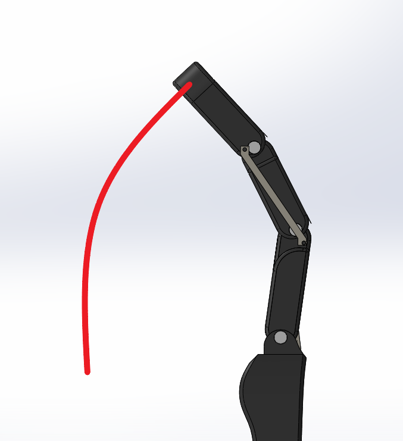

# Underactuated_Arm
The repository contains the design files of an Underactuated  Arm designed in Solidworks.

# Hand Model

In the following lines, we briefly describe the main idea and the modelling of our hand in *SolidWorks*. 
This design was used in our *Hand Imitation* project to mimic the movements of a human hand. Hence it was imperative to design it as such.

## Basic Model

First we had to design the actual shape of our hand and only then could we continue to reduce the actuations on it.
Each finger was to be made of three main links joined with each other while the thumb was made of only two.
This was done by only making one link out of three of a single finger finger, and then its dimensions were modified according to the dimensions of each finger. In such a way we got all our fingers.

Next the palm and arm were modelled with appropriate dimensions and everything assembled together in *SolidWorks*

## Main Idea

The main idea was to devise a *closed loop kinematics* model which would require least number of servo motors to pull  off the idea of hand imitation. 

We know that the motion of a finger on our arm is very much constrained and we don't require the control of every joint in a finger independently. We used this knowledge to introduce *two link rods* in our model with one connecting the palm to the middle link and the other connecting the bottom link to the top one respectively in a criss-cross pattern.

This configuration under actuated our model as now only one servo was required for each finger.
The configuration restricted the movement of the end-effector of each finger to travel along a fixed semicircular path each time the finger is bent like a human hand.

## Conclusion

Due to the design constraints introduced by us, now we only had to control the botton link of our finger in order to bend it. Hence we successfully limited our actuations. A revolute joint was also introduced on the wrist to free the movement of the palm.

And thus our model was complete.

